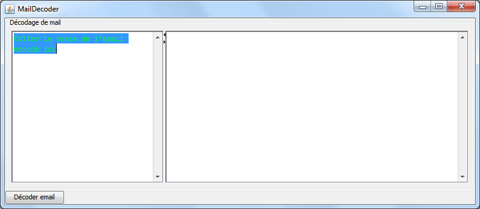

# MailDecoder
Mail decoder.

I used to wrok at a company where the meeting requests emails got processed as spam by our mail server.
They were delivered as encrypted MIME stuff and we weren't able to reply or even know what it was about.

So I developped this bunch of code that reads the encrypted data (via a simple copy/paste) and then recreates a valid email with attachments.
It allowed us to reply and attend the meetings...

I used winrun4j when my coworkers asked me to provide the tool but were unable to use it as raw java jar since they're weren't used to java stuff.
